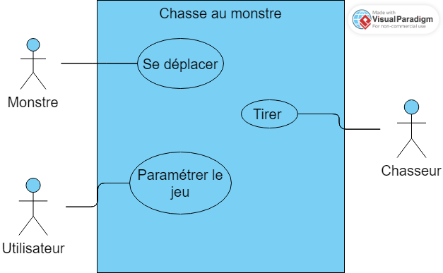
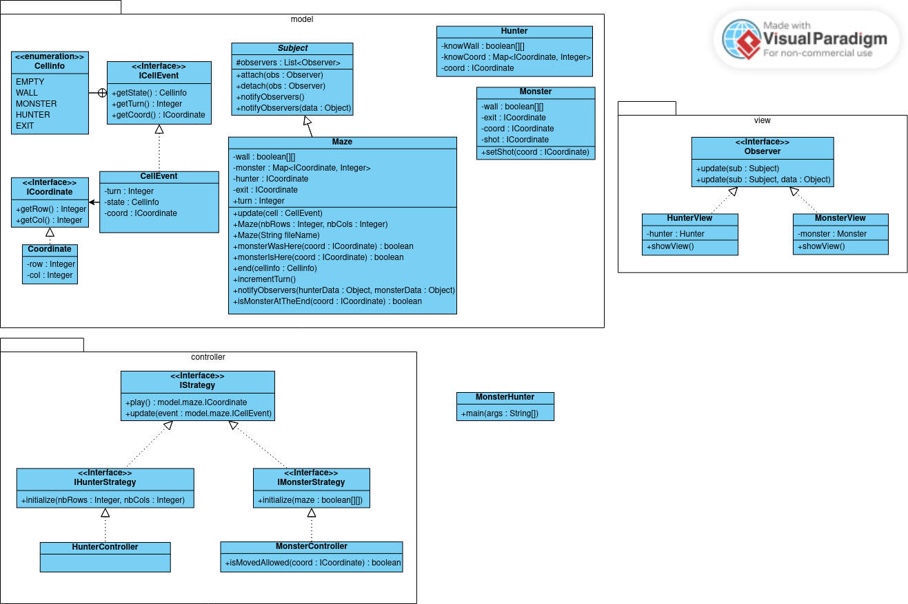

# Rendu Analyse SAÉ03A
Groupe J1 | Charles Coudé | Simon Hayart | Raphaël Kiecken | Hugo Vallée 

## Diagrame : 

### Diagrame de Cas d'utilisation : 

*Si l'image ne s'affiche pas correctement cliquez [ici](./Digramme_de_cas_d'utilisation.png)*

### Diagrame de Classe : 

*Si l'image ne s'affiche pas correctement cliquez [ici](./Diagramme_de_classe.png)*

## Description des méthodes Principal.

### Début du tour du Hunter :

- La vue du Hunter s'affiche -> showView()

- Hunter joue, renvoie coord -> play():coord
    - Coordonnée de la case sur laquel il tire
- Maze reçoit les coordonnée, met à jour la variable hunter avec les nouvelle coordonée
    - update(new CellEvent(coord, turn, cellinfo))
        - coord : Coordonée de la case
        - turn : 0 (default)
        - cellinfo : Cellinfo.HUNTER (Car c'est le hunter qui joue)

#### Verification du model :

- Le Maze vérifie si le Monster est déjà passé sur la case -> monsterWasHere(coord)
    - Si true :
        - Le Maze vérifie si le Monster est actuellement sur cette case -> monsterIsHere(coord)
    - Si true : 
        - Le Hunter a gagné -> end(cellinfo)
            cellinfo : Cellinfo.HUNTER car c'est le Hunter qui gagne
    - Sinon :
        - Le Maze créer et stock un new CellEvent(coord, turn, cellinfo) déstiné au Hunter
            - coord : Coordonnée de la case
            - turn : Tour durant lequel le Monster est passé sur la - case
            - cellinfo : Cellinfo.MONSTER car la case a été traversé par le Monster
    - Sinon : 
        - Le Maze vérifie si la case est un mur -> isWall(coord)
            - Si true :
                - Le Maze créer et stock un new CellEvent(coord, turn, cellinfo) déstiné au Hunter
                    - coord : Coordonnée de la case
                    - turn : 0 (default)
                    - cellinfo : Cellinfo.WALL car la case est un mur
            - Sinon : 
                - Le Maze créer et stock un new CellEvent(coord, turn, cellinfo) déstiné au Hunter
                    - coord : Coordonnée de la case
                    - turn : 0 (default)
                    - cellinfo : Cellinfo.EMPTY car la case est vide

- Le Maze créer et stock un new CellEvent(coord, turn, cellinfo) déstiné au Monster
    - coord : Coordonée de la case
    - turn : 0 (default)
    - cellinfo : Cellinfo.HUNTER pour indiquer que le Hunter vient de tirer

- Le Maze notifie les vues -> notifyObervers(cellEventHunter, cellEventMonster)

- La vue du Hunter contient une variable hunter de type Hunter qui représente ses données
- La vue du Hunter les mets à jour quand elle reçoit la notification CellEvent(coord, turn, cellinfo) (variable selon la case, comme expliqué plus haut) du Maze
    - Si cellinfo == MONSTER : 
        - hunter ajoute dans la map knowCoord les coordonée du Monster et le tour -> knowCoord.put(coord, turn)
    - Sinon si cellinfo == WALL :
        - hunter met à jour son tableau de boolean avec true à l'endroit qui correspond au coord -> wall[coord.getRow()][coord.getCol()] = true
    - Sinon :
        - hunter met à jour son tableau de boolean avec false à l'endroit qui correspond au coord -> wall[coord.getRow()][coord.getCol()] = false

- La vue du Monster contient une variable monster de type Monster qui représente ses données
- La vue du Monster les mets à jour quand elle reçoit la notification CellEvent(coord, turn, cellinfo) 

- Si cellinfo == HUNTER :
    - monster ajoute dans la variable les coordonée du Hunter et le tour -> setShot(coord)

- Le maze incrémente les tours -> incrementTurn()

### Example de cas d'Utilisation : 

initialisation des coordonées :
- coord = 5,3

#### Début du tour du Monster :

- La vue du Monster s'affiche -> showView()

- Monster joue, renvoie coord -> play()
    - coord : Coordonnée de la case sur laquel il souhaite ce deplacer
- Le controller s'assure de la véracité des coordonnées -> isMoveAllowed(coord)
- Si true : 
    - Le controller envoie un new CellEvent(coord, turn, cellinfo)
        - coord : Coordonée de la case
        - turn : 5 (tour correspondant au tour du deplacement du monstre)
        - cellinfo : Cellinfo.MONSTER (Car c'est le monstre qui joue)
- Sinon:
    - Demande de nouveau les coordonnees -> play()

- Maze reçoit les coordonnée, ajoute les coordonnées du monster a la variable avec les nouvelle coordonée -> update(hunterEvent)

- Le Maze vérifie si le Monster est sur la case de fin -> isMonsterAtTheEnd(coord)
    - Si true :
        - Le Monstre a gagné -> end(cellinfo)
        cellinfo : Cellinfo.MONSTER car c'est le Monster qui gagne
    - Sinon : 
        - Le Maze notifie les vue un new CellEvent(coord, turn,     cellinfo) -> notifyObervers(cellEventMonster)
            - coord : Coordonée de la case
            - turn : 5 (tour correspondant au tour du deplacement du monstre)
            - cellinfo : Cellinfo.MONSTER (Car c'est le monstre qui joue)

- La vue du Monster contient une variable monster de type Monster qui représente ses données
- La vue du Monster les mets à jour quand elle reçoit la notification CellEvent(coord, turn, cellinfo) du Maze
- Si cellinfo == MONSTER : 
    - monster met à jour la variable coord avec les nouvelle coordonée du Monster
